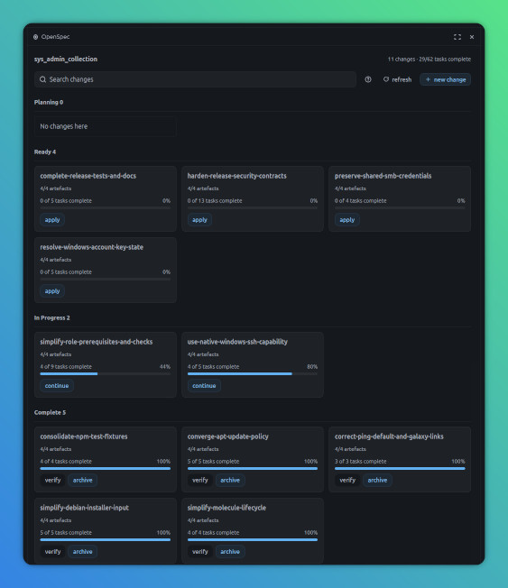
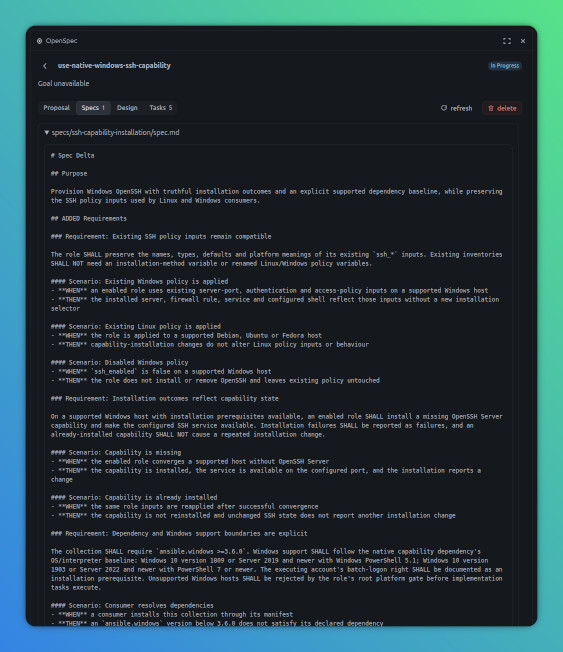

# OpenSpec for OpenChamber

An OpenChamber panel and full-page board for the OpenSpec changes in your selected project or
worktree. Browse planning artefacts and CLI-reported tasks without searching the file tree. Create
or delete active changes, prepare editable, unsent per-change workflow prompts in your chat, or
launch confirmed bulk archiving in a new session.




## Scope

This is a lightweight GUI for OpenSpec, not a separate planning system. OpenSpec's CLI remains the
source of truth for changes, artefacts and task progress. Contributions that make its information
easier to view or keep this extension up to date with OpenSpec are welcome.

## Before you start

- Install the [OpenSpec CLI](https://openspec.dev/docs/installation) on the OpenChamber server, with
  `openspec` on its `PATH`. Use a version that supports `status --all --json` (tested with 1.13.1).
- Select the project you want to use and initialise OpenSpec.

For faster loads, you can turn off OpenSpec usage telemetry on the OpenChamber server:

```sh
openspec config set telemetry.enabled false
```

Telemetry can add a wait to each CLI command. The extension does not change your telemetry setting.
Environment variables set for the OpenChamber launcher do not reach the extension's service; use the
OpenSpec config command instead.

## Get your project ready

1. If needed, install the CLI on the OpenChamber server:

   ```sh
   npm install -g @fission-ai/openspec@latest
   openspec --version
   ```

2. Run `openspec config profile`. Keep the core workflows and add **verify**, which this board uses
   but OpenSpec does not install by default. Choose skills delivery (or both skills and commands).
   This profile is a machine-wide OpenSpec setting.
3. Initialise OpenSpec for OpenCode in the project you want on the board:

   ```sh
   cd /path/to/your-project
   openspec init --tools opencode
   openspec list --json
   ```

   The listing should report your project's root, even with no changes yet. If you change the
   profile later, run `openspec update` in each existing project. Restart OpenCode if its skills are
   not visible.

## Install the extension

1. In OpenChamber, open **Settings > Extensions**. Paste
   `https://github.com/jaythomasonprojects/openchamber-openspec.git` into **Folder, ZIP, or URL**
   and select **Add**.
2. Review its permissions and choose **Allow and enable** if you trust it. Its local service runs
   `openspec` with your user access. Per-change workflow prompts remain unsent; confirmed **archive
   all** creates a session and submits a prompt. Updates adding the sessions permission require
   reapproval.
3. Select the OpenSpec-enabled project in OpenChamber, then open the **OpenSpec** rail panel or find
   it under **Extension pages**. An empty board is expected until you have an active change. Use
   **new change** to create one, or open an existing change to read its artefacts and tasks.

Git installations can check for updates in **Settings > Extensions**.

## Archive completed changes

Choose **archive all** beside **new change**, then confirm with **start archiving**. **cancel** or
Escape dismisses the dialogue without creating a session. The secondary button is available when the
loaded board has a Complete change; search does not narrow the operation.

The new session uses your selected project or worktree and the host's current model and agent
settings. The agent checks fresh CLI state, skips unfinished and zero-task changes, and archives
completed changes sequentially through the archive skill. It can ask spec-sync questions or report
blockers; the button does not approve those choices or guarantee unattended completion.

The board and your current draft stay open. Follow the new session in the session list and use
**refresh** to see updates. If creation or submission fails, inspect the reported session (or check
the session list after an uncertain outcome) before starting again. The extension never retries
automatically. Existing per-change **archive** continues to prepare an editable, unsent draft.

## Develop locally

Use Node 22.13+, npm and the OpenSpec CLI. Run `npm ci`, `npx playwright install chromium`, then
`npm run check` to lint, check formatting and types, test, and build both installable bundles.
OpenChamber does not build extensions when it installs them.

For local changes, install this folder in **Settings > Extensions**. Rebuild and reinstall after
updates; disable and re-enable the extension to restart its service. A panel reload does not restart
the service.
